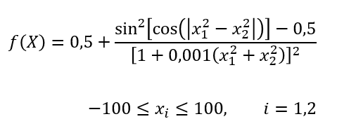

# Enfriamiento Simulado (SA), Algoritmo Genético (GA) y Algoritmo de Enjambre (PSO) para Schaffer Modificada N.3
En este repositorio están los algoritmos de Enfriamiento simulado, algoritmo genético y algoritmo de enjambre para resolver hallar el mínimo o realizar la minimización de la función de Schaffer modificada N.3.
\
En el repositorio hay dos carpetas:
* Implementaciones con librerías
* Implementaciones de prueba

## Implementaciones con librerías:
En esta carpeta hay 3 archivos:
1. **Ga-Schaffer.py**: Es en donde está implementada la función con la librería *geneticalgorithm2* para poder utilizar el algoritmo genético.
2. **PSO-Schaffer.py**: Es en donde está implementada la función con la librería *pyswarms* para poder utilizar el algoritmo de enjambre.
3. **SA-Schaffer.py**: Es en donde está implementada la función con la librería *simanneal* para poder utilizar el enfriamiento simulado.

## Implementaciones de prueba:
En esta carpeta hay 3 archivos, todos pertenecen a pruebas hechas con enfriamiento simulado:
1. **Prueba1-SA.py**: Fue un algoritmo hecho por los autores, tiene la misma estructura que el algoritmo que nos mostró la profesora en clase.
2. **Prueba2-SA.py**: Fue un algoritmo hecho por los autores, cambia un poco la estructura utilizando un *for* y manejando la temperatura de otra manera diferente.
3. **Prueba3-SA.py**: Fue un algoritmo que encontramos en un repositorio de GitHub, maneja bastante diferente la estructura y la temperatura. Link del repositorio: https://github.com/Valdecy/Metaheuristic-Simulated_Annealing

# Links de las librerías:
* **pyswarms**: https://pypi.org/project/pyswarms/, https://pyswarms.readthedocs.io/en/latest/index.html
* **geneticalgoritm2**: https://pypi.org/project/geneticalgorithm2/
* **simanneal**: https://github.com/perrygeo/simanneal

# Autores
Gian Astori\
Daniel Cogollos\
Ricardo De la Cruz\
Juan Díaz\